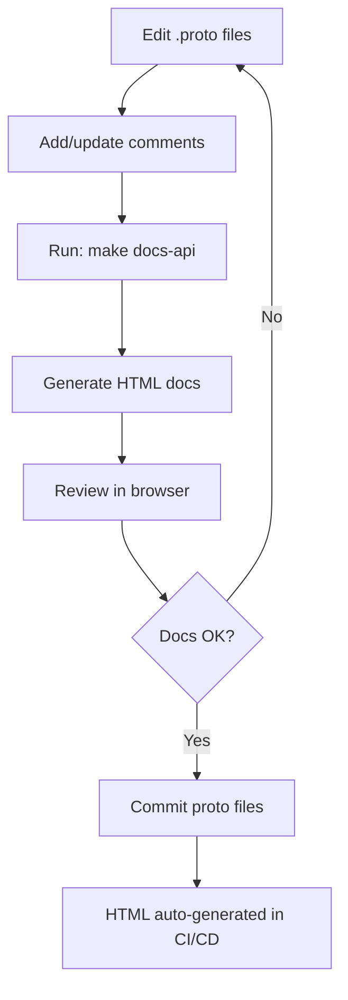

# Documentation Structure

## Directory Layout

```
docs/
├── api/                                    # Auto-generated API Documentation
│   ├── README.md                          # API documentation guide
│   ├── landing.html                       # Visual navigation page
│   ├── index.html                         # Complete API index (911 KB)
│   │
│   ├── Identity & Access Management
│   │   ├── auth.html                      # Authentication (185 KB)
│   │   ├── user.html                      # User management (270 KB)
│   │   ├── tenant.html                    # Tenant management (149 KB)
│   │   └── entity.html                    # Entity management (161 KB)
│   │
│   ├── Human Resources
│   │   ├── employee.html                  # Employees (146 KB)
│   │   ├── contractors.html               # Contractors (136 KB)
│   │   └── vendors.html                   # Vendors (137 KB)
│   │
│   ├── Organizational
│   │   ├── organization.html              # Org structure (204 KB)
│   │   └── dms.html                       # Document Management (250 KB)
│   │
│   ├── Data Management
│   │   ├── databridge.html                # Data bridge (207 KB)
│   │   ├── dataarchive.html               # Archival (253 KB)
│   │   └── backupdr.html                  # Backup/DR (296 KB)
│   │
│   ├── Analytics & Search
│   │   ├── insighthub.html                # Insights hub (216 KB)
│   │   ├── insightviewer.html             # Insights viewer (263 KB)
│   │   └── metasearch.html                # Meta search (210 KB)
│   │
│   ├── Forms & Workflows
│   │   └── formbuilder.html               # Form builder (359 KB)
│   │
│   ├── Operations
│   │   ├── scheduler.html                 # Scheduler (167 KB)
│   │   ├── notification.html              # Notifications (203 KB)
│   │   ├── masters.html                   # Masters (198 KB)
│   │   └── pipeline.html                  # Pipeline (157 KB)
│   │
│   ├── Projects & Core
│   │   ├── projects.html                  # Projects (131 KB)
│   │   ├── core.html                      # Core utils (154 KB)
│   │   └── packages.html                  # Packages (120 KB)
│   │
│   └── Total: 25 files, ~5.5 MB
│
├── Architecture & Planning
│   ├── dms-architecture.md                # DMS architecture design
│   ├── organizational-hierarchy-plan.md   # Org hierarchy planning
│   ├── implementation-roadmap.md          # Implementation roadmap
│   ├── technical-specifications.md        # Technical specs
│   └── user-permissions-analysis.md       # Permissions analysis
│
├── Implementation Docs
│   ├── PERMISSION-IMPLEMENTATION-SUMMARY.md
│   ├── PERMISSION-SYSTEM-ANALYSIS.md
│   ├── IMPLEMENTATION-SUMMARY.md
│   ├── FINAL-SESSION-SUMMARY.md
│   └── PERSONNEL-MODULE-RESTRUCTURING.md
│
├── Planning & Status
│   ├── SUMMARY-PLANNING-SESSION.md
│   ├── SESSION-TODO-LIST.md
│   ├── TODO-MASTER-LIST.md
│   ├── QUICK-STATUS.md
│   └── documentation-strategy-options.md
│
├── Infrastructure
│   ├── DOCUMENTATION-INFRASTRUCTURE.md    # This infrastructure summary
│   ├── DOCUMENTATION-STRUCTURE.md         # This file
│   └── README.md                          # Main docs index
│
└── Proto Documentation
    └── proto/
        ├── core/proto/readme.md
        └── projects/protos/readme.md
```

## File Categories

### Auto-Generated (Do Not Edit)
- `docs/api/*.html` - Generated from proto files
- Size: ~5.5 MB total
- Count: 25 HTML files

### Manually Maintained
- `docs/api/README.md` - API documentation guide
- `docs/README.md` - Main documentation index
- `docs/DOCUMENTATION-*.md` - Infrastructure docs
- `docs/*.md` - Architecture and planning docs

### Configuration
- `.gitignore` - Excludes `docs/api/*.html`
- `Makefile` - Documentation generation targets

## Quick Reference

### Generate Documentation
```bash
make docs-api        # Generate API docs
make docs            # Generate all docs
make docs-clean      # Clean generated files
make docs-serve      # Serve locally (port 8000)
```

### Access Documentation
```bash
# Start server
make docs-serve

# Open in browser
http://localhost:8000/docs/api/landing.html    # Landing page
http://localhost:8000/docs/api/index.html      # Complete index
http://localhost:8000/docs/api/{module}.html   # Specific module
```

### File Locations (Absolute Paths)
```
Root:     /d/Maheshwari/UGCL/backend/v2/
Docs:     /d/Maheshwari/UGCL/backend/v2/docs/
API Docs: /d/Maheshwari/UGCL/backend/v2/docs/api/
Makefile: /d/Maheshwari/UGCL/backend/v2/Makefile
```

## Module Coverage

### Documented Modules (24)
- ✅ organization
- ✅ dms
- ✅ identity/entity
- ✅ identity/user
- ✅ identity/auth
- ✅ identity/tenant
- ✅ employee
- ✅ contractors
- ✅ vendors
- ✅ formbuilder
- ✅ backupdr
- ✅ dataarchive
- ✅ databridge
- ✅ scheduler
- ✅ insighthub
- ✅ insightviewer
- ✅ metasearch
- ✅ projects
- ✅ masters
- ✅ pipeline
- ✅ notification
- ✅ core
- ✅ packages

## Statistics

| Metric | Value |
|--------|-------|
| Total HTML Files | 25 |
| Total Size | ~5.5 MB |
| Modules Documented | 24 + packages |
| README Files | 4 |
| Makefile Targets | 4 |
| Infrastructure Docs | 3 |

## Documentation Workflow



## Maintenance Checklist

- [ ] Regenerate docs after proto changes
- [ ] Review generated HTML for clarity
- [ ] Update README files as needed
- [ ] Keep architecture docs current
- [ ] Add new modules to landing.html
- [ ] Update this structure doc when adding modules

---

**Last Updated**: October 5, 2025
**Infrastructure Status**: ✅ Complete
