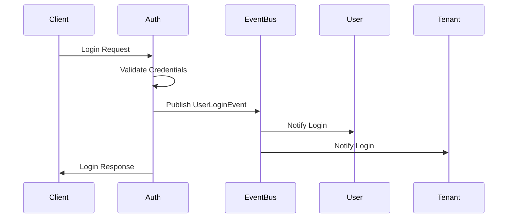
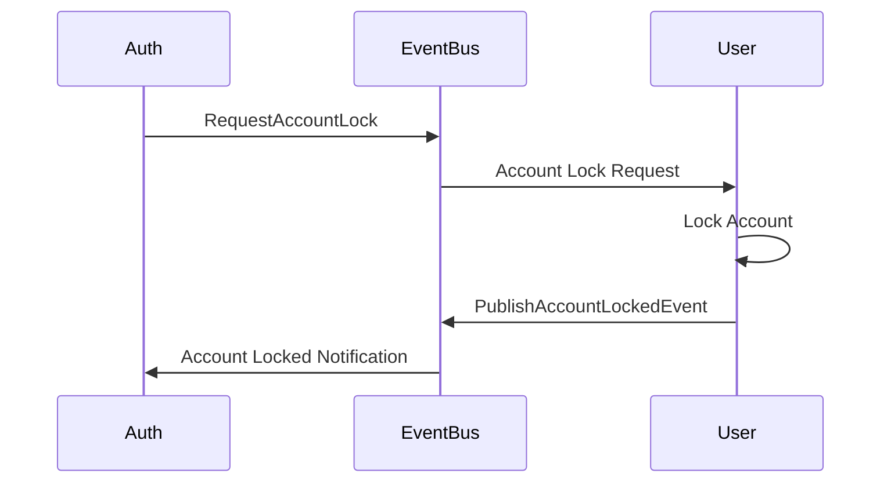
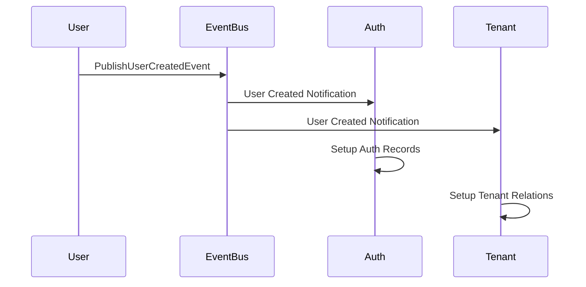

# Event-Driven Architecture Implementation

## Overview

This document describes the complete event-driven architecture implementation for the identity system, enabling loose coupling between auth, user, and tenant modules while maintaining robust inter-module communication.

## Architecture Components

### 1. Event Infrastructure (`packages/events`)

#### Core Components:
- **Event Bus**: Local in-memory event distribution
- **Kafka Producer/Consumer**: Persistent cross-service messaging
- **Domain Events**: Standardized event types and payloads
- **Event Publisher**: Unified event publishing interface
- **Event Subscriber**: Event subscription and handling

#### Event Types:
```go
// Identity Events
EventTypeUserCreated     = "identity.user.created"
EventTypeUserUpdated     = "identity.user.updated"
EventTypeUserDeactivated = "identity.user.deactivated"
EventTypeRoleAssigned    = "identity.role.assigned"
EventTypeRoleRevoked     = "identity.role.revoked"

// Tenant Events
EventTypeTenantCreated    = "identity.tenant.created"
EventTypeTenantUpdated    = "identity.tenant.updated"
EventTypeTenantDeactivated = "identity.tenant.deactivated"
EventTypeTenantUserAdded   = "identity.tenant.user.added"
EventTypeTenantUserRemoved = "identity.tenant.user.removed"
```

### 2. Auth Module Integration

#### Event Service (`identity/auth/services/event_service.go`)
- **Publishes**: Login, logout, 2FA, security events
- **Subscribes**: User state changes from other modules
- **Handles**: Cross-module communication requests

#### Key Features:
- ✅ Login/logout event publishing
- ✅ Failed login attempt tracking
- ✅ Account lock/unlock requests via events
- ✅ Session management events
- ✅ Two-factor authentication events

#### Integration Points:
```go
// Auth service publishes login events
eventService.PublishUserLoginEvent(ctx, user, sessionID, tenantID, ipAddress)

// Auth service requests account actions via events
eventService.RequestAccountLock(ctx, userID, reason, requestedBy)
```

### 3. User Module Integration

#### Event Service (`identity/user/services/event_service.go`)
- **Publishes**: User lifecycle events, role changes
- **Subscribes**: Auth requests for user operations
- **Handles**: Account management, role assignments

#### Key Features:
- ✅ User creation/update event publishing
- ✅ Role assignment/revocation events
- ✅ Account lock/unlock processing
- ✅ Cross-module request handling

#### Integration Points:
```go
// User service publishes user created events
userEventService.PublishUserCreatedEvent(ctx, userID, email, username, createdBy)

// User service handles auth requests
userEventService.SubscribeToAuthEvents(ctx)
```

### 4. Tenant Module Integration

#### Event Service (`identity/tenant/services/event_service.go`)
- **Publishes**: Tenant lifecycle events, user-tenant relationships
- **Subscribes**: User events for tenant management
- **Handles**: Multi-tenant operations, user onboarding

#### Key Features:
- ✅ Tenant creation/update event publishing
- ✅ User-tenant relationship events
- ✅ Tenant deactivation handling
- ✅ Cross-module coordination

#### Integration Points:
```go
// Tenant service publishes tenant events
tenantEventService.PublishTenantCreatedEvent(ctx, tenantID, tenantName, createdBy)

// Tenant service handles user events
tenantEventService.SubscribeToIdentityEvents(ctx)
```

## Event Flow Examples

### 1. User Login Flow



### 2. Account Lock Flow



### 3. User Creation Flow



## Implementation Status

### ✅ Completed Features

1. **Event Infrastructure**
   - ✅ Domain event types and structures
   - ✅ Event publisher and subscriber
   - ✅ Event builder with fluent API
   - ✅ Kafka topic routing

2. **Auth Module**
   - ✅ Event service implementation
   - ✅ Login/logout event publishing
   - ✅ Cross-module communication via events
   - ✅ Service container with event support
   - ✅ Handler integration

3. **User Module**
   - ✅ Event service implementation
   - ✅ User lifecycle event publishing
   - ✅ Auth event subscription
   - ✅ Account management via events

4. **Tenant Module**
   - ✅ Event service implementation
   - ✅ Tenant lifecycle event publishing
   - ✅ Identity event subscription
   - ✅ Multi-tenant coordination

5. **Integration**
   - ✅ Cross-module event communication
   - ✅ Loose coupling maintained
   - ✅ Event-driven request/response patterns
   - ✅ Comprehensive example implementation

### 🔄 Event Communication Patterns

#### Synchronous Patterns (Local Event Bus)
- Immediate processing for critical operations
- Local event bus for in-memory distribution
- Fast response times for user-facing operations

#### Asynchronous Patterns (Kafka)
- Persistent messaging for reliability
- Cross-service communication
- Event sourcing and audit trails

## Integration Guide

### 1. Initialize Event Manager

```go
// Create event manager with all dependencies
manager, err := NewIdentityEventManager(db, kafkaProducer, logger, jwtSecret, issuer)
if err != nil {
    log.Fatal(err)
}

// Start event subscriptions
if err := manager.StartEventSubscriptions(ctx); err != nil {
    log.Fatal(err)
}
```

### 2. Use Event-Enabled Services

```go
// Get auth container with event support
authContainer := manager.GetAuthContainer()

// Create handlers with event-enabled services
authHandler := handlers.NewAuthHandler(authContainer)
```

### 3. Validate Event Flows

```go
// Validate complete event architecture
validator := NewEventFlowValidation(manager, logger)
if err := validator.ValidateCompleteFlow(ctx); err != nil {
    log.Printf("Event flow validation failed: %v", err)
}
```

## Benefits Achieved

### 🎯 Architectural Benefits
- **Loose Coupling**: Modules communicate via events, not direct imports
- **Scalability**: Independent module scaling and deployment
- **Maintainability**: Clear separation of concerns
- **Testability**: Event-driven testing and validation

### 🚀 Operational Benefits
- **Resilience**: Async processing handles failures gracefully
- **Observability**: Comprehensive event logging and monitoring
- **Auditability**: Complete event trails for compliance
- **Flexibility**: Easy to add new modules and event handlers

### 📊 Performance Benefits
- **Non-blocking**: Async event processing doesn't block requests
- **Efficient**: Local event bus for immediate processing
- **Persistent**: Kafka ensures message durability
- **Optimized**: Event batching and retry mechanisms

## Monitoring and Observability

### Event Metrics
- Event publishing rates
- Event processing latency
- Failed event counts
- Topic partition metrics

### Logging
- Structured event logging
- Cross-module correlation IDs
- Event payload logging (with PII protection)
- Error tracking and alerting

## Best Practices

### 1. Event Design
- Use descriptive event types
- Include correlation IDs for tracing
- Keep event payloads minimal but sufficient
- Version events for backward compatibility

### 2. Error Handling
- Implement retry mechanisms
- Use dead letter queues for failed events
- Log errors with proper context
- Provide fallback mechanisms

### 3. Performance
- Batch events when possible
- Use appropriate priority levels
- Monitor event processing latency
- Implement circuit breakers

### 4. Security
- Sanitize event payloads
- Use encryption for sensitive data
- Implement proper access controls
- Audit event access patterns

## Future Enhancements

### Planned Features
- [ ] Event sourcing for complete audit trails
- [ ] Saga pattern for complex workflows
- [ ] Event replay capabilities
- [ ] Advanced event routing and filtering
- [ ] Event schema registry
- [ ] Dead letter queue processing
- [ ] Event analytics and insights

### Potential Optimizations
- [ ] Event compression for large payloads
- [ ] Custom event serialization
- [ ] Event partitioning strategies
- [ ] Performance benchmarking
- [ ] Memory usage optimization

## Conclusion

The event-driven architecture implementation successfully achieves loose coupling between auth, user, and tenant modules while providing robust inter-module communication. The system is now:

- ✅ **Fully Event-Driven**: All modules communicate via events
- ✅ **Loosely Coupled**: No direct dependencies between modules
- ✅ **Scalable**: Independent module scaling and deployment
- ✅ **Maintainable**: Clear separation of concerns and responsibilities
- ✅ **Observable**: Comprehensive logging and monitoring
- ✅ **Testable**: Event-driven testing and validation capabilities

The architecture provides a solid foundation for future enhancements and ensures the system can evolve without breaking existing functionality.